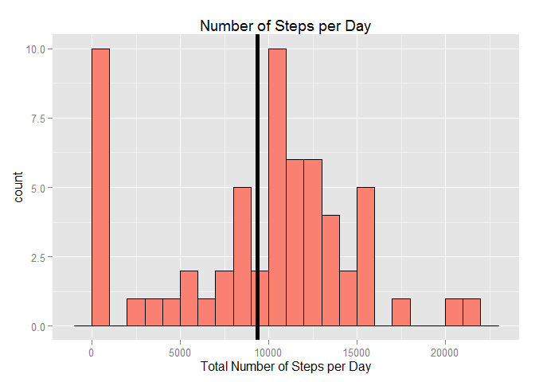
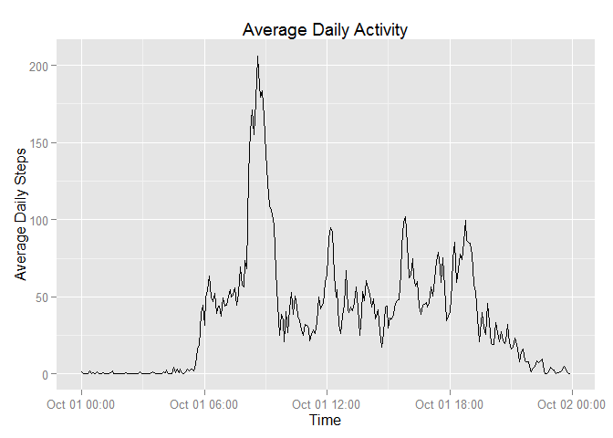
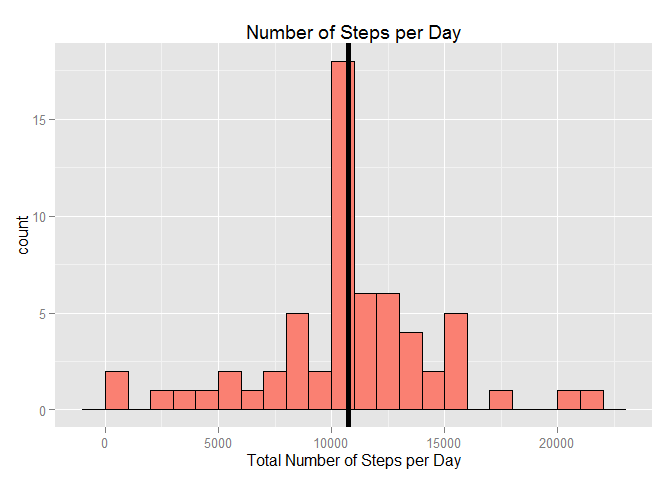

# Reproducible Research: Peer Assessment 1


## Loading and preprocessing the data


```r
library(ggplot2); library(dplyr); library(lubridate)
```

```
## 
## Attaching package: 'dplyr'
## 
## The following objects are masked from 'package:stats':
## 
##     filter, lag
## 
## The following objects are masked from 'package:base':
## 
##     intersect, setdiff, setequal, union
```

```r
data <- tbl_df(read.csv("activity.csv"))


char_interval <- formatC(data$interval, width = 4, flag = "0")

date_time <- strptime(paste(data$date, char_interval), format = "%Y-%m-%d %H%M")
data$date_time <- as.POSIXct(date_time)


# Create a new variable called day_time.
# It will store the intervals as "Period" objects (from package lubridate)
day_time <- format(data$date_time, format = "%H:%M")

day_time <- hm(day_time)

data$day_time <- day_time
```


## What is mean total number of steps taken per day?


```r
data_perDay <- data %>%
  group_by(date) %>%
  summarise(totSteps_perDay = sum(steps, na.rm = TRUE),
            avgSteps_perDay = mean(steps, na.rm = TRUE))

g <- ggplot(data = data_perDay, aes(x = totSteps_perDay))
g <- g + 
  geom_histogram(fill = "salmon", color = 'black', binwidth = 1000) +
  labs(list(title = "Number of Steps per Day", 
            x = "Total Number of Steps per Day")) +
  geom_vline(xintercept = mean(data_perDay$totSteps_perDay, 
                               na.rm = T), size = 2)
g
```

 

```r
mean_total <- mean(data_perDay$totSteps_perDay)

median_total <- median(data_perDay$totSteps_perDay)

mean_total
```

```
## [1] 9354.23
```

```r
median_total
```

```
## [1] 10395
```

- The mean total number of steps taken per day = 9354.2295082
- The median of total number of steps taken per day = 10395

## What is the average daily activity pattern?


```r
# Group the data by intervals and calculate the mean as per group
# this will give us the avg. number of steps per interval 
# averaged across all days
daily_activity <- data %>%
  group_by(interval) %>%
  summarise(daily_avg_steps = mean(steps, na.rm = TRUE))

# To plot, we need the intervals of any day as date_time object.
# I extracted the first 24*12 rows from the date_time variable in the 
# original data set. (We have 24 hours, each contains 12 intervals)
# Then add it as a new column to the daily_activity data set
daily_activity$date_time <- data$date_time[1: 288]
daily_activity$day_time <- data$day_time[1: 288]

library(scales)
g <- ggplot(data = daily_activity, 
            aes(x = date_time, y = daily_avg_steps)) 
g <- g + 
  geom_line() +
  labs(list(title = "Average Daily Activity", x="Time", y="Average Daily Steps"))
g
```

 

```r
daily_activity
```

```
## Source: local data frame [288 x 4]
## 
##    interval daily_avg_steps           date_time day_time
##       (int)           (dbl)              (time)    (dbl)
## 1         0       1.7169811 2012-10-01 00:00:00       0S
## 2         5       0.3396226 2012-10-01 00:05:00    5M 0S
## 3        10       0.1320755 2012-10-01 00:10:00   10M 0S
## 4        15       0.1509434 2012-10-01 00:15:00   15M 0S
## 5        20       0.0754717 2012-10-01 00:20:00   20M 0S
## 6        25       2.0943396 2012-10-01 00:25:00   25M 0S
## 7        30       0.5283019 2012-10-01 00:30:00   30M 0S
## 8        35       0.8679245 2012-10-01 00:35:00   35M 0S
## 9        40       0.0000000 2012-10-01 00:40:00   40M 0S
## 10       45       1.4716981 2012-10-01 00:45:00   45M 0S
## ..      ...             ...                 ...      ...
```

```r
maxSteps_interval <- subset(daily_activity, daily_avg_steps == max(daily_avg_steps))$day_time
```

The $5-minute$ interval that contains the maximum number of steps is: 

```r
maxSteps_interval
```

```
## [1] "8H 35M 0S"
```


## Imputing missing values
###1- Total number of missing values in the dataset:

```r
count_na <- sum(!complete.cases(data))
count_na
```

```
## [1] 2304
```

###2, 3- A strategy for filling in all of the missing values in the dataset:

```r
# Examine each columns to see which ones contain NAs
anyNA(data$date)
```

```
## [1] FALSE
```

```r
anyNA(data$interval)
```

```
## [1] FALSE
```

```r
anyNA(data$steps)
```

```
## [1] TRUE
```

```r
# Only (steps) contains NAs
# I will replace each NA value in the (steps) variable by the mean of
# the entire variable, i.e: mean(steps)
data_new <- data
data_new$steps[is.na(data_new$steps)] <- mean(data_new$steps, na.rm = TRUE)
```

We can see now there's no any NA values in (steps):

```r
anyNA(data_new$steps)
```

```
## [1] FALSE
```

###4- Plotting total steps per day and Calculating and reporting the mean and median


```r
data_perDay_new <- data_new %>%
  group_by(date) %>%
  summarise(totSteps_perDay = sum(steps),
            avgSteps_perDay = mean(steps))

g <- ggplot(data = data_perDay_new, aes(x = totSteps_perDay))
g <- g + 
  geom_histogram(fill = "salmon", color = 'black', binwidth = 1000) +
  labs(list(title = "Number of Steps per Day", 
            x = "Total Number of Steps per Day")) +
  geom_vline(xintercept = mean(data_perDay_new$totSteps_perDay), size = 2)
g
```

 

```r
mean_total_new <- mean(data_perDay_new$totSteps_perDay)

median_total_new <- median(data_perDay_new$totSteps_perDay)

mean_total_new
```

```
## [1] 10766.19
```

```r
median_total_new 
```

```
## [1] 10766.19
```

- The average of total steps per day for the new data $= 1.0766189\times 10^{4}$
- The median of total steps per day for the new data $= 1.0766189\times 10^{4}$ 


## Are there differences in activity patterns between weekdays and weekends?


